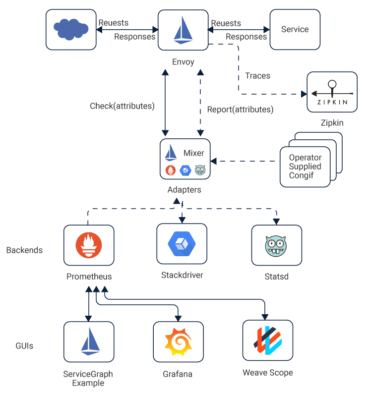

# ISTIO

## Introduction

Istio is an open source independent service mesh that provides the fundamentals you need to successfully run a distributed microservice architecture.

## Architecture



## Features

* Traffic Management
* Policies and Security
* Observability
* Performance and Scalability

## Installation

Istio installtion guide can be found at [here](https://istio.io/docs/setup/install/helm/).
It has two options,
* Install with Helm via helm template
* Install with Helm and Tiller via helm install

Also, it has multiple profiles based on your requirements. Such as,
* default
* demo
* demo-auth
* minimal
* sds
* Istio CNI enabled

Addition to that, if you are going to deploy on minikube / kind for testing, recommended to go with `values-istio-demo-common.yaml` file.

`helm install install/kubernetes/helm/istio --name istio --namespace istio-system \ --values install/kubernetes/helm/istio/values-istio-demo-common.yaml`

Successful installation should run all the istio modules.

```$ kubectl get po -n istio-system                                                                                                
NAME                                               READY   STATUS              RESTARTS   AGE
grafana-59d57c5c56-gqq74                           1/1     Running             0          19s
istio-citadel-5bd7bf658c-ljghg                     1/1     Running             0          19s
istio-egressgateway-7d76487f5-qt5qw                1/1     Running             0          19s
istio-galley-779c5689df-xfhtz                      1/1     Running             0          19s
istio-ingressgateway-85b5cbc6cb-dnprd              1/1     Running             0          19s
istio-init-crd-10-release-1.3-latest-daily-gpk2g   0/1     Completed           0          50s
istio-init-crd-11-release-1.3-latest-daily-kf7v7   0/1     Completed           0          50s
istio-init-crd-12-release-1.3-latest-daily-xpm9r   0/1     Completed           0          50s
istio-pilot-697487b99-zj5px                        2/2     Running             0          19s
istio-policy-75cff84db6-qdssx                      2/2     Running             0          19s
istio-sidecar-injector-65866d7466-rgqfx            1/1     Running             0          19s
istio-telemetry-686c49c856-rv4fp                   2/2     Running             0          19s
istio-tracing-6bbdc67d6c-t46tz                     1/1     Running             0          18s
kiali-8c9d6fbf6-5xhrb                              1/1     Running             2          28s
prometheus-7d7b9f7844-tn5gz                        1/1     Running             0          18s
zipkin-5cddf8d669-8wg74                            1/1     Running             0          18s
```

## Deploy an App

Add label `istio-injection` to namesapce default where we going to deploy our app and create manifest file for platform-ui.

`kubectl label namespace default istio-injection=enabled`

``` apiVersion: v1
kind: Service
metadata:
  name: platform-ui
  labels:
    app: platform-ui
    service: platform-ui
spec:
  ports:
  - port: 80
    name: http
  selector:
    app: platform-ui
---
apiVersion: apps/v1
kind: Deployment
metadata:
  name: platform-ui
  labels:
    app: platform
spec:
  replicas: 1
  selector:
    matchLabels:
      app: platform-ui
  template:
    metadata:
      labels:
        app: platform-ui
    spec:
      containers:
      - name: platform-ui
        image: hmda/platform-ui:urlchange6
        imagePullPolicy: IfNotPresent
        ports:
        - containerPort: 80
---
```
apiVersion: networking.istio.io/v1alpha3
kind: Gateway
metadata:
  name: platform-ui
spec:
  selector:
    istio: ingressgateway
  servers:
  - port:
      number: 80
      name: http
      protocol: HTTP
    hosts:
    - "*"
---
apiVersion: networking.istio.io/v1alpha3
kind: VirtualService
metadata:
  name: platform-ui
spec:
  hosts:
  - "*"
  gateways:
  - platform-ui
  http:
  - match:
    - uri:
        prefix: /
    route:
    - destination:
        host: platform-ui
        port:
          number: 80
```
```

Run the above deployment file and check the running pods in default namespace

```
$kubectl get po                                                                                                                                                                            ✔  6697 
NAME                              READY   STATUS    RESTARTS   AGE
platform-ui-658c4b5d45-pzbnx   2/2     Running   2          44s
```

You can access the web page using `DNS` or `IP:PORT`
