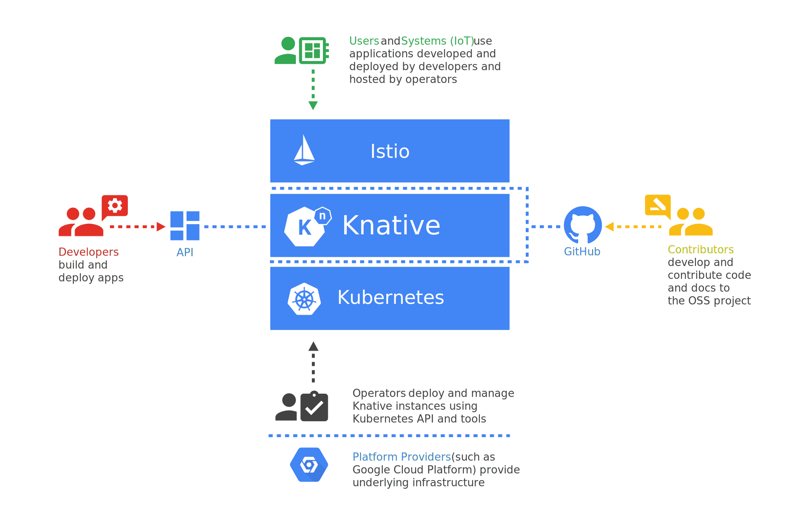

# KNATIVE

## Introduction

Knative (pronounced kay-nay-tiv) extends Kubernetes to provide a set of middleware components that are essential to build modern, source-centric, and container-based applications that can run anywhere: on premises, in the cloud, or even in a third-party data center.

## Architecture



## Features

Knative has two main components.
* Eventing - Run serverless containers on Kubernetes with ease, Knative takes care of the details of networking, autoscaling (even to zero), and revision tracking.
* Serving - Universal subscription, delivery, build and management of events.\

## Installation

First install Knative CRDs. Here we are only installing serving component. Because, we are not going to build a docker image.
Same time monitoring components will be handled by Istio. It comes with Knative.

```
kubectl apply -l knative.dev/crd-install=true \
--filename https://github.com/knative/serving/releases/download/v0.8.1/serving.yaml
```

```
kubectl apply --selector knative.dev/crd-install=true \
--filename https://github.com/knative/serving/releases/download/v0.8.1/serving.yaml
```

Successful installation should run all the knative serving components run.

```
$ kubectl get po -n knative-serving

NAME                                READY   STATUS    RESTARTS   AGE
activator-655f5bd47-lwxm8           2/2     Running   0          20s
activator-68b98f8d65-g2qf2          2/2     Running   0         25s
autoscaler-6f6d4fddc4-h9q5l         2/2     Running   0          25s
autoscaler-hpa-6cf84fbb44-glndj     1/1     Running   0          20s
autoscaler-hpa-f584bccd7-fmgbv      1/1     Running   0          20s
controller-67b586588c-2bm6s         1/1     Running   0          23s
controller-6f4d6b5f94-bk9sk         1/1     Running   0          20s
networking-istio-7d9bfbcd86-df8vl   1/1     Running   0          20s
networking-istio-8494b4d47b-jbtmn   1/1     Running   0          22s
webhook-ff8bfd76c-xbwl2             1/1     Running   0          20s
```

## Deploy an App

```
apiVersion: serving.knative.dev/v1alpha1
kind: Service
metadata:
  name: hsi-ui
  namespace: default
spec:
  template:
    spec:
      containers:
        - image: hmda/platform-ui:urlchange6
```

Run the above service file and check the running pods in default namespace and services.

`kubectl get ksvc`
